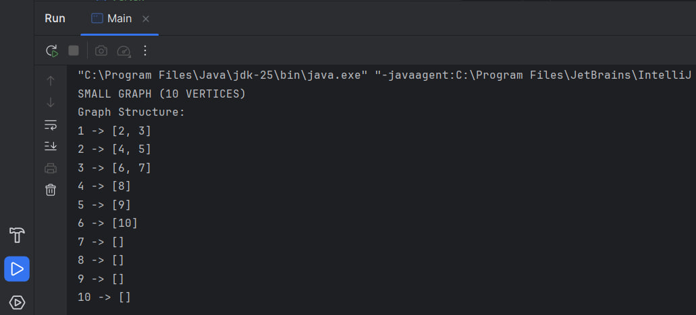
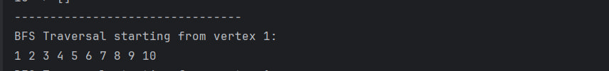
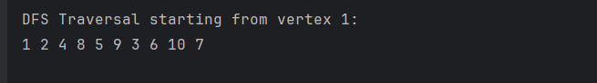
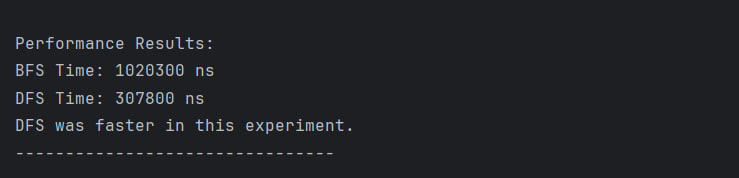
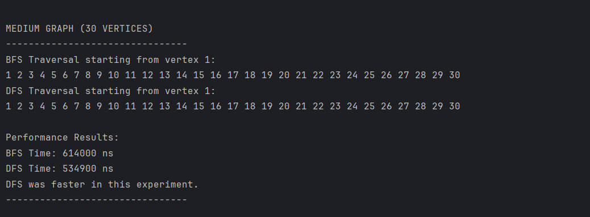
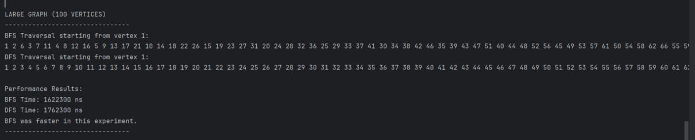
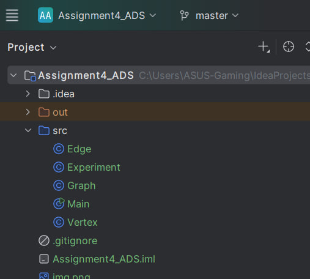

# Assignment 4 — Graph Traversal and Representation System

## Student Information

- Name: Yerali Karkinbayev
- Course: Algorithms and Data Structures 
- Assignment: Assignment 4

---

# A. Project Overview

This project demonstrates graph traversal algorithms in Java using an adjacency list representation.

The program includes:
- Vertex class
- Edge class
- Graph class
- BFS traversal
- DFS traversal
- Performance analysis using `System.nanoTime()`

A graph consists of:
- vertices (nodes)
- edges (connections between nodes)

Example:

```text
1 -> [2, 3]
2 -> [4]
3 -> [4]
```

The project uses:
- `HashMap`
- `ArrayList`

to store the adjacency list.

BFS explores the graph level-by-level, while DFS explores depth-first using recursion.

---

# B. Class Descriptions

## Vertex Class
Represents a graph node.

### Responsibilities
- store vertex ID
- provide getter method
- return readable output

---

## Edge Class
Represents a connection between two vertices.

### Responsibilities
- store source vertex
- store destination vertex
- provide readable edge information

---

## Graph Class
Main class of the project.

### Responsibilities
- store vertices and edges
- manage adjacency list
- add vertices and edges
- print graph structure
- run BFS and DFS

---

## Experiment Class
Handles:
- traversal execution
- performance testing
- execution time comparison

---

## Main Class
Runs the whole project:
- creates graphs
- adds edges
- runs traversals
- displays results

---

# C. Algorithm Descriptions

# Breadth-First Search (BFS)

BFS explores the graph level-by-level using a Queue.

### BFS Steps
1. Start from selected vertex
2. Mark vertex as visited
3. Add vertex into queue
4. Visit neighbors
5. Repeat until queue becomes empty

### BFS Use Cases
- shortest path problems
- GPS systems
- social networks

### BFS Complexity

```text
O(V + E)
```

Where:
- `V` = vertices
- `E` = edges

---

# Depth-First Search (DFS)

DFS explores the graph depth-first using recursion.

### DFS Steps
1. Start from selected vertex
2. Mark vertex as visited
3. Visit neighbors recursively
4. Backtrack when needed

### DFS Use Cases
- maze solving
- cycle detection
- path finding

### DFS Complexity

```text
O(V + E)
```

---

# D. Experimental Results

The program was tested using:
- 10 vertices
- 30 vertices
- 100 vertices

## Execution Time Comparison

| Graph Size | BFS Time (ns) | DFS Time (ns) |
|---|---|---|
| 10 vertices | 1020300 |307800 |
| 30 vertices | 614000 | 534900 |
| 100 vertices | 1622300 | 1762300 |

---

# Observations

As graph size increased, execution time also increased.

Both BFS and DFS showed complexity close to `O(V + E)` because both algorithms process each vertex and edge once.

Traversal order depended on graph structure and edge connections.

---

# E. Screenshots

## Graph Structure Output


---

## BFS Traversal Output




---

## DFS Traversal Output



---

## Performance Results





---

# F. Reflection

This project helped me better understand graph traversal algorithms and adjacency list representation.

I learned the main difference between BFS and DFS:
- BFS uses a queue and explores level-by-level,
- DFS uses recursion and explores depth-first.

One challenge was preventing repeated visits during traversal. Using a visited set solved this problem.

The project also helped me understand how graph size affects algorithm performance.

---

# GitHub Repository Structure

